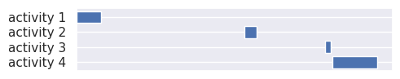

# Python Tools for Investigating & Visualizing Activity in anesthetic records
A toolkit for extracting, parsing, and processing anesthetic records and making sense of the activity therein, especially intra-operative records.

## Installation
Available via PyPI using your favorite python package manager.
```
$ pip3 install pytiva
```

## What can pytiva do?
* Extract data after export from an electronic health record system
* Define and extract anesthesia activities using intra-operative events or the administration of medications
* Unduplicate these activities by any strata of interest, such as patient or case ID number
* Determine total concurrent activities, including aggregating by day and time
* Visualization of so-called gantt charts and heat maps of activity, as below

### Examples of visualizations
##### Gantt chart of raw activity for one patient


##### Gantt chart of unduplicated activity for one patient


##### Heatmap of concurrent activity


## Links and further reading
* Get started with a brief tutorial: https://github.com/tjbiel85/pytiva/blob/main/tutorial.ipynb
* Bugs and issue tracking: https://github.com/tjbiel85/pytiva/issues
